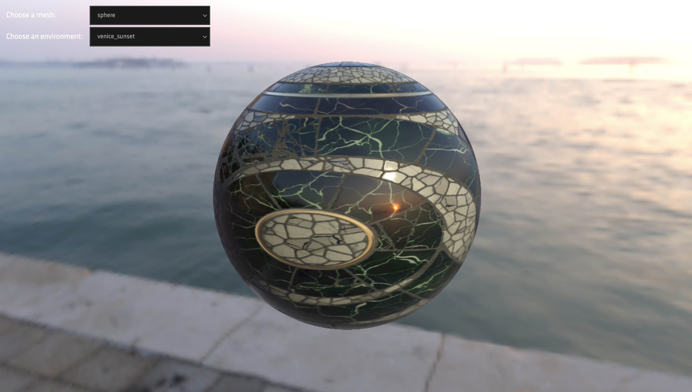

# MTLX-VIEWER


Сервис для просмотра [mtlx-материалов](https://www.materialx.org/) в 3D-режиме. Поддерживаются материалы версии `1.38` и выше.

# ИСПОЛЬЗОВАНИЕ

Материал и его зависимости необходимо положить в директорию `public/materials/<material>`. В файле-материале пути на все 
текстуры-зависимости должны быть нормализованы: имеется в виду - абсолютными от корня сервера, где будет развёрнут сервис.
`bxdf`, `stdlib`, `alglib` класть в директорию с материалом не нужно.
[Пример.](public/materials/demo/demo.mtlx)

# API

```yaml
openapi 3.0
info:
  title: MTLX-VIEWER
  version: 1.0
paths:
  /:
    get:
      summary: Просмотра материала
      parameters:
        - in: path
          name: material
          schema:
            type: string
            default: 'public/materials/demo/demo.mtlx'
          required: false
          description: Путь к материалу на сервере
        - in: path
          name: mesh
          schema:
            type: string
            default: 'public/environments/royal_esplanade.hdr'
          required: false
          description: Путь к мешу на сервере
        - in: path
          name: environment
          schema:
            type: string
            default: 'public/meshes/sphere.glb'
          required: false
          description: Путь к окружению на сервере
```